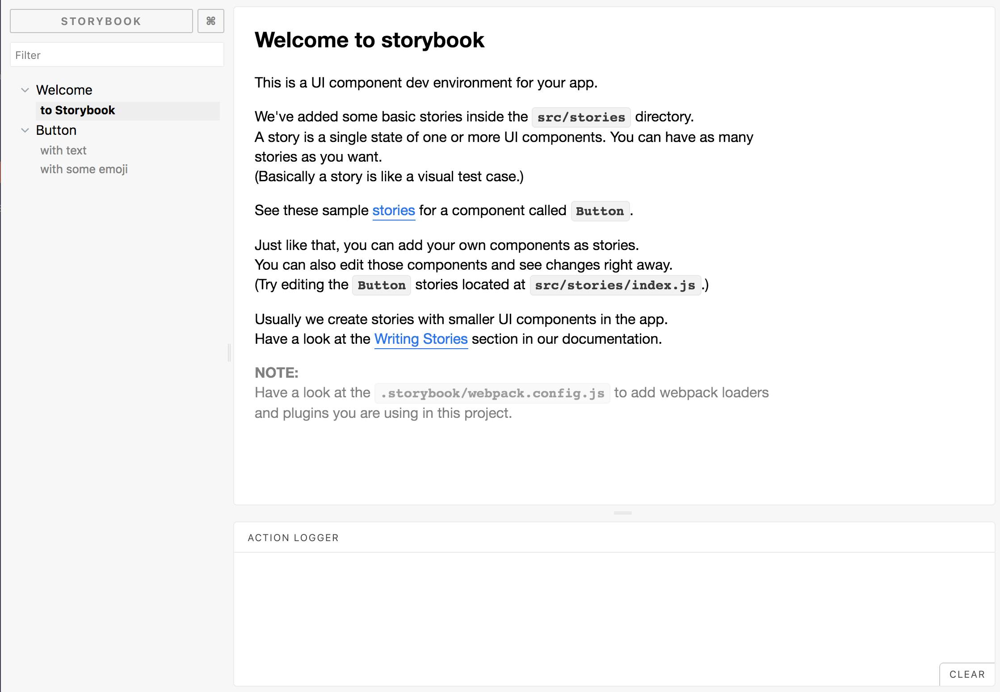
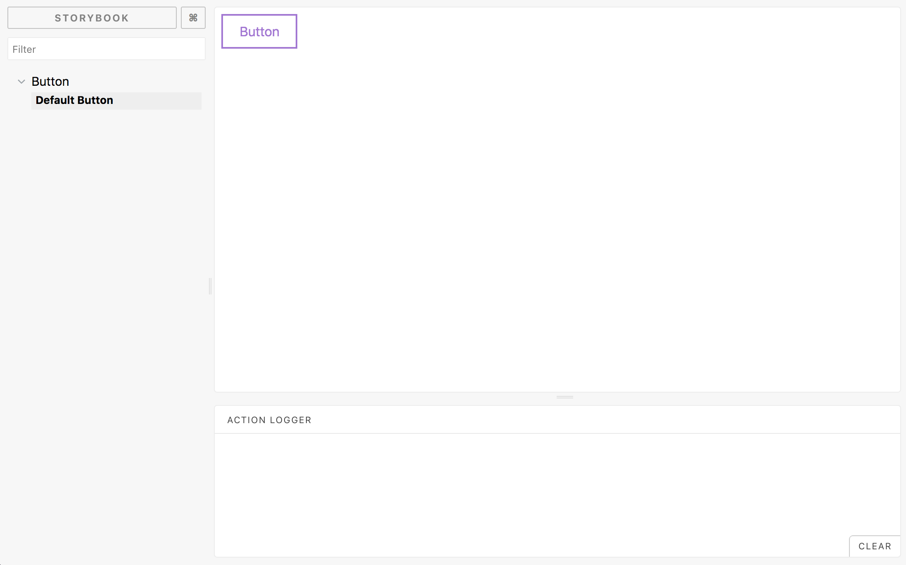
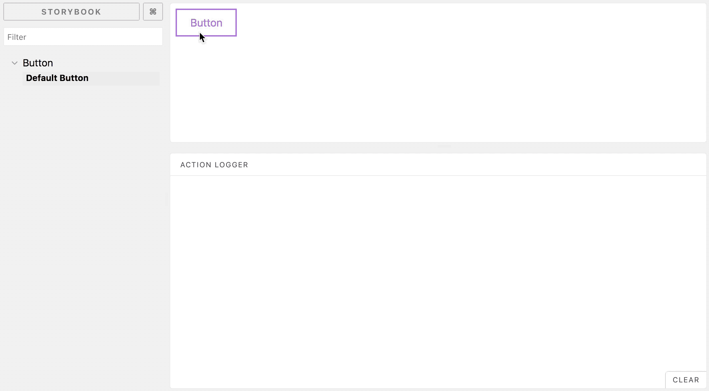
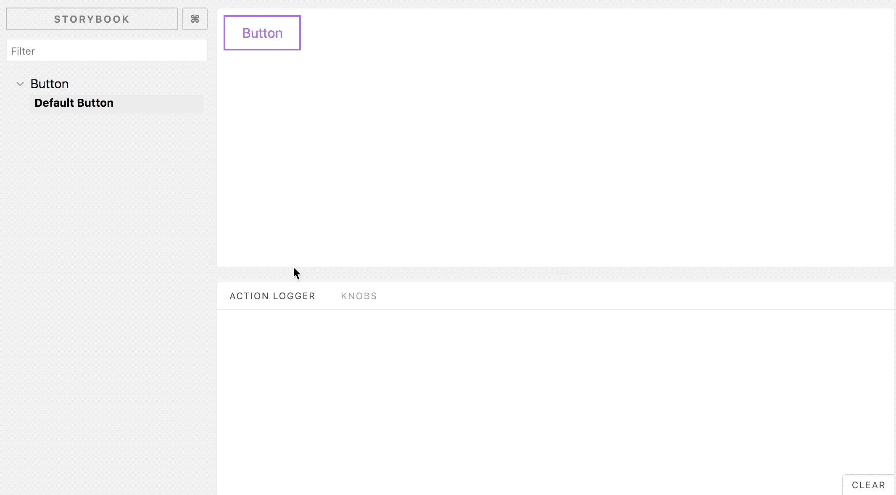
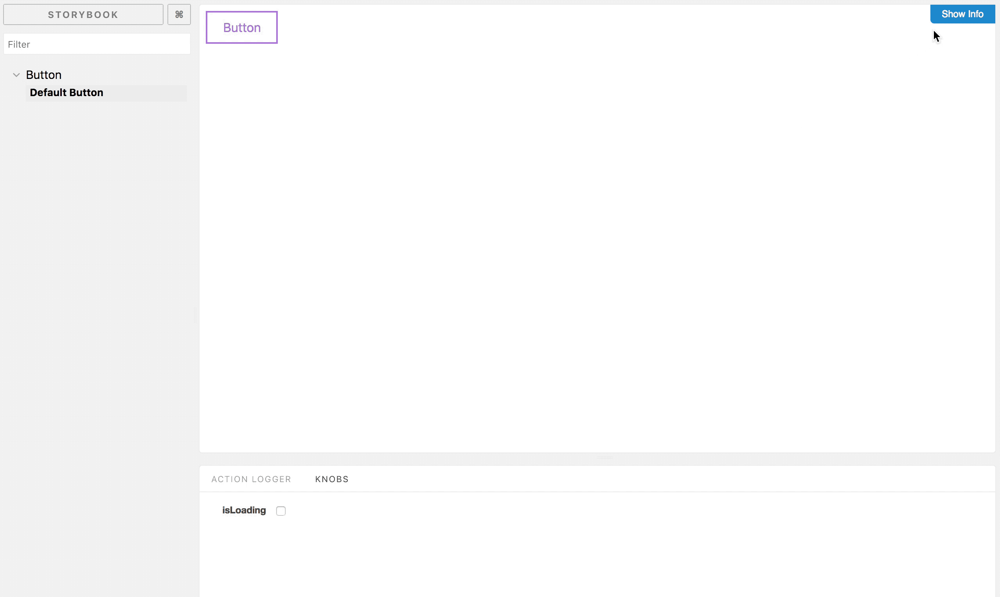

# Einangrað þróunarumhverfi fyrir viðmótseiningar

React hefur farið um vefheima eins og eldur í sinu, ný og ný verkefni poppa upp á hverjum degi og fleiri og fleiri eru að bæta við react í verkfærasettið sitt. Samfélagið hefur stækkað og hægt er að finna npm pakka fyrir flest þekkt viðmótsvandamál. Einnig er hægt að nota react til að skrifa viðmót fyrir allt frá símaforriti yfir í skipunarlínutól.

Þar sem react er einingasinnað "framework" býður það uppá marga möguleika þegar kemur að tólum til að einfalda okkur skipulag og vinnu.

Það sem mig langar að sýna ykkur er hvernig hægt er að nota react og nokkur tól frá samfélaginu til að setja upp einangrað þróunarumhverfi fyrir viðmótseiningar og leið til að sniðmáta endurtekinn kóða til að spara okkur tíma, það vita allir að tími === peningar!


Hér á eftir ætlum við að setja upp React verkefni og nota [Storybook.js](https://storybook.js.org/) til að halda utan um viðmótseiningar og skoða nokkrar storybook viðbætur (e. addons).

Svo setjum við upp [Hygen](https://www.hygen.io/) til að sniðmáta endurtekinn kóða, sem í leiðinni leyfir okkur að halda uppi samræmi á uppbyggingu viðmótseininga í verkefninu

## Storybook.js

Storybook er síða sem keyrir samhliða verkefninu, og sýnir viðmótseiningar í einangruðu umhverfi. Þar getur þú þróað einingarnar og stillt þeim upp í mismunandi ástandi.

Storybook er með mjög virkt samfélag og helling af [viðbótum](https://storybook.js.org/addons/addon-gallery/). Hér eru nokkrar viðbætur sem ég get mælt með

* [Actions](https://github.com/storybooks/storybook/tree/master/addons/actions)  
  *Sýnir gögn sem skila sér úr event handlerum (sjá sýnishorn í dæminu hér á eftir)*
* [Knobs](https://github.com/storybooks/storybook/tree/master/addons/knobs)  
  *Bætir við stillieiginleikum fyrir eininguna (sjá sýnishorn í dæminu hér á eftir)*
* [Info](https://github.com/storybooks/storybook/tree/master/addons/info)  
  *Notað til að skjala einingu, hægt að skjala með Markdown og bætir einnig við töflu út frá propTypes (sjá sýnishorn í dæminu hér á eftir)*
* [a11y](https://github.com/storybooks/storybook/tree/master/addons/a11y)  
  *Hjálpar með aðgengismál*
* [Jest](https://github.com/storybooks/storybook/tree/master/addons/jest)  
  *Sýnir niðurstöður úr jest prófum inni í sögunni*

## Halló Storybook.js!

Við skulum prófa að henda upp litlu verkefni og tengja okkur inni í sögubókina.

Til að auðvelda okkur lífið þá "bootströppum" við verkefnið með [Create React App](https://github.com/facebook/create-react-app)

```
$ yarn create react-app storybook
$ cd storybook
```

Svo þurfum við að sækja skipunarlínu tólið fyrir sögubókina, og keyra það inni í verkefninu

```
$ yarn global add @storybook/cli
$ getstorybook
$ yarn run storybook
```

Nú ættum við að sjá sögubókina á [http://localhost:9009/](http://localhost:9009/)



## Stillingar

Áður en við byrjum á fullu er gott að stilla aðeins sögubókina út frá okkar þörfum.

Sjálfgefið þá fáum við stories undir `./src/stories` í okkar tilfelli viljum við hafa söguna í sömu möppu og einingin, þá breytum við `.storybook/config.js`

```javascript
import { configure } from '@storybook/react'

function loadStories() {
  const req = require.context('../src/components', true, /\.story\.js$/)
  req.keys().forEach(filename => req(filename))
}

configure(loadStories, module)
```

Hér tókum við út `require('../src/stories');` og notum [`require.context()`](https://webpack.js.org/guides/dependency-management/#require-context) sem leyfir okkur að leita að skjölum í undirmöppum út frá regex, og við skilum svo öllum sögunum inni í configure.

Þar sem við erum að nota [Create React App](https://github.com/facebook/create-react-app) v2 þá kemur það með [css modules](https://github.com/facebook/create-react-app/blob/master/packages/react-scripts/template/README.md#adding-a-css-modules-stylesheet), til að virkja það í storybook þá þurfum við að bæta við css modules í webpack.

`.storybook/webpack.config.js` 
```javascript
module.exports = {
  module: {
    rules: [
      {
        test: /\.css$/,
        use: [
          {
            loader: 'style-loader',
          },
          {
            loader: 'css-loader',
            options: {
              modules: true,
            },
          },
        ],
      },
    ],
  },
}
```


## Viðmótseiningar

Þá er næst að gera component möppuna og bæta við fyrsta componentinum okkar.
```
./src/components/Button/index.js
./src/components/Button/Button.js
./src/components/Button/Button.module.scss
./src/components/Button/Button.story.js
```

`index.js`
```javascript
export { default } from './Button'
```

`Button.js`
```javascript
import React from 'react'
import styles from './Button.module.css'

const Button = ({ children, className, ...props }) => {
  const classNames = (...args) => args.join(' ')
  const buttonClass = classNames(styles.button, className)
  return <button className={buttonClass} {...props}>{children}</button>
}

export default Button
```

`Button.module.css`
```css
.button {
  background: transparent;
  border: 2px solid #AA72D8;
  color: #AA72D8;
  padding: 10px 20px;
  font-size: 16px;
}
```

`Button.story.js`
```javascript
import React from 'react'
// Sögu fallið
import { storiesOf } from '@storybook/react'
import Button from './Button'

// Bætir við Button flokk í veftréð
storiesOf('Button', module)
  // Bætir við sögu undir Button
  .add('Default Button', () => (
    <Button>Button</Button>
  ))
}
```

Nú erum við komin með fyrstu viðmótseininguna okkar, og ætti þá sögubókin að líta svona út



## Nú getum við farið að nota viðbætur til að gera söguna gagnvirka.


### Actions

Byrjum á því að bæta við Action logger til að sjá click eventið á takkanum

`Button.story.js`
```javascript
...

import { action } from '@storybook/addon-actions'

storiesOf('Button', module)
  .add('Default Button', () => (
    <Button onClick={action('Clicked!')}>Button</Button>
  ))
```



### Knobs

Bætum við biðstöðu eiginleika á takkann, og notum svo Knobs til að slökkva og kveikja á biðstöðu.

Fyrst þurfum við að sækja viðbótina `yarn add -D @storybook/addon-knobs`
Svo bætum við henni við í `.storybook/addons.js`
```javascript
...
import '@storybook/addon-knobs/register'
```

Uppfærum takkann til að taka á móti `isLoading`

`Button.js`
```javascript
...

const Button = ({ children, className, isLoading, ...props }) => {
  const classNames = (...args) => args.join(' ')
  const buttonClass = classNames(styles.button, className)
  return <button className={buttonClass} {...props}>{isLoading ? 'Loading...' : children}</button>
}

...
```

`Button.story.js`
```javascript
...
import { withKnobs, boolean } from '@storybook/addon-knobs'

storiesOf('Button', module)
  // Bætum við decorator með Knobs
  .addDecorator(withKnobs)
  .add('Default Button', () => {
    // setjum upp boolean rofa
    const isLoading = boolean('isLoading', false)
    return <Button onClick={action('Clicked!')} isLoading={isLoading}>Button</Button>
  })

```




### Info

Hvernig væri að henda smá skjölun á þetta?

Til þess ætlum við að nota info viðbótið `yarn add -D @storybook/addon-info`

`Button.story.js`
```javascript
...
import { withInfo } from '@storybook/addon-info'

storiesOf('Button', module)
  // withInfo tekur á móti "options object" eða MD streng
  .addDecorator((story, context) => withInfo(`
    This is a **button**!
  `)(story)(context))
  .addDecorator(withKnobs)
  .add('Default Button', () => {
    const isLoading = boolean('isLoading', false)
    return <Button
      onClick={action('Clicked!')}
      isLoading={isLoading}
    >Button</Button>
  })
```




Eins og sést hér fyrir ofan þá er Button ekki með nein propTypes, við skulum bæta þeim við til að skoða props töfluna.

Byrjum á að sækja `yarn add prop-types`

`Button.js`
```javascript
import React from 'react'
import styles from './Button.module.css'
import propTypes from 'prop-types'

const Button = ({ children, className, isLoading, ...props }) => {
  const classNames = (...args) => args.join(' ')
  const buttonClass = classNames(styles.button, className)
  return <button className={buttonClass} {...props}>{isLoading ? 'Loading...' : children}</button>
}

Button.propTypes = {
  /** Show button loading state */
  isLoading: propTypes.bool
}

Button.defaultProps = {
  isLoading: false
}

export default Button

```


Eins og sést hér á myndinni þá kemur taflan sjálfkrafa inn út frá propTypes á Button og með því að nota `/** comment */` þá er hægt að fylla út í description dálkinn.

## Hygen

Við erum búin að skoða hvernig við getum bætt Storybook.js við react verkefni. Næst ætlum við að skoða hvernig við getum minnkað endurtekningar með því að nota kóðasmið (e. code generator).

[Hygen](https://hygen.io) er skipunarlínu tól sem er auðvelt í notkun og býr til kóða út frá sniðmáti (e. template) sem fær að fylgja verkefninu. Sniðmátin eru skrifuð í [EJS](http://ejs.co/) sem þýðir að við getum notað javascript lógík inni í sniðmátinu

Til að setja upp hygen þá getum við annaðhvort set það upp "globally"
```
$ yarn global add hygen
```
Eða keyrt það beint með npx
```
$ npx hygen ...
```

Til að byrja með þá frumstillum við sniðmátið okkar með því að keyra eftirfarandi frá rótinni á verkefninu
```
$ hygen init self 
```
Þá setur hygen upp generator sniðmát sem þú getum notað til að búa til önnur sniðmát


Í okkar tilfelli ætlum við að setja upp generator frá grunni.
Hygen möppustrúktúr er settur upp "_templates/ nafn á generator / nafn á sniðmáti / sniðmát"
Byrjum á að bæta við eftirfarandi skjölum

```
/_templates/gen/cmp/index.ejs.t
/_templates/gen/cmp/cmp.ejs.t
/_templates/gen/cmp/story.ejs.t
/_templates/gen/cmp/prompt.js
```

`index.ejs.t`
```javascript
---
// Stillingar fyrir sniðmátið
// Stilling hvert skjalið á að fara, hér er hægt að nota ejs syntax og nálgast breytur sem eru settar í smiðinn
to: src/components/<%= name %>/index.js
---
export { default } from './<%= name %>'

```

`cmp.ejs.t`
```javascript
---
to: src/components/<%= name %>/<%= name %>.js
---
import React from 'react'

const <%= name %> = () => {
  return (
    <div>
      <h2><%= name %> component</h2>
    </div>
  )
}

export default <%= name %>

```

`story.ejs.t`
```javascript
---
// hér notum við ternary til að skila slóðini, ef við skilum null þá verður skjalið ekki til
to: "<%= story ? 'src/components/' + name  + '/' + name + '.story.js' : null %>"
---
import React from 'react'
import { storiesOf } from '@storybook/react'
import { withInfo } from '@storybook/addon-info'
import { withKnobs } from '@storybook/addon-knobs'
import <%= name %> from './<%= name %>'

storiesOf('<%= name %>', module)
  .addDecorator((story, context) => withInfo(`<%= name %> component`)(story)(context))
  .addDecorator(withKnobs)
  .add('<%= name %>', () => (
    <<%= name %> />
  ))

```

`prompt.js`
```javascript
// see types of prompts:
// https://github.com/SBoudrias/Inquirer.js#prompt-types
//
// and for examples for prompts:
// https://github.com/SBoudrias/Inquirer.js/tree/master/examples
module.exports = [
  {
    type: 'input',
    name: 'name',
    message: "What's the name of your component?"
  },
  {
    type: 'list',
    name: 'story',
    message: 'Include story component?',
    choices: [{ name: 'Yes', value: true }, { name: 'No', value: false }]
  }
]

```

Hér erum við búin að taka endurtekningarnar út fyrir sviga og fyllum uppí með upplýsingum sem við sækjum úr prompt.js

Nú getum við prófað að keyra hygen


## Conclusion (WIP)

* einangrað vinnuumhverfi fyrir viðmótseiningar
* spara tíma og haldið í vinnureglur